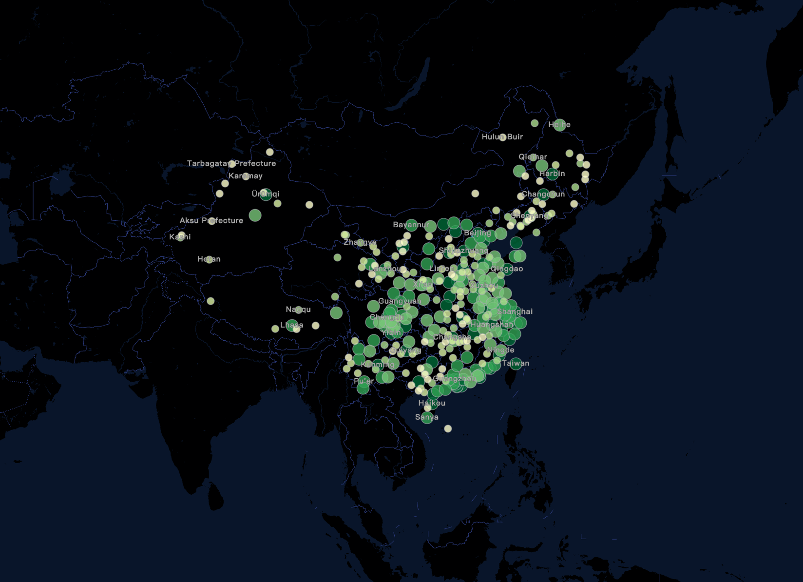
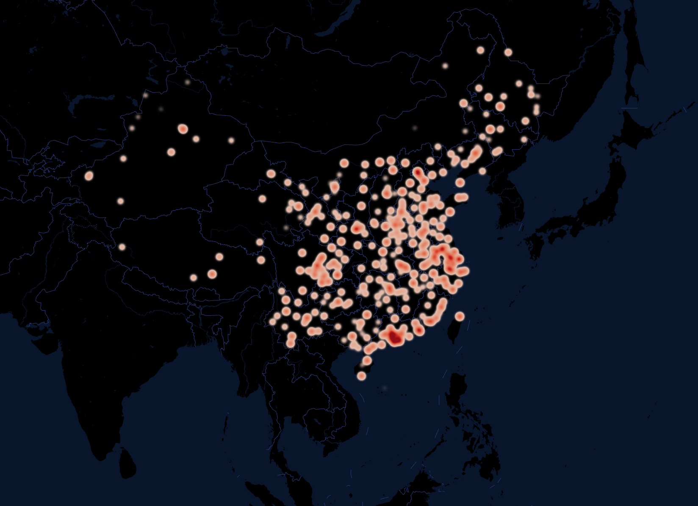
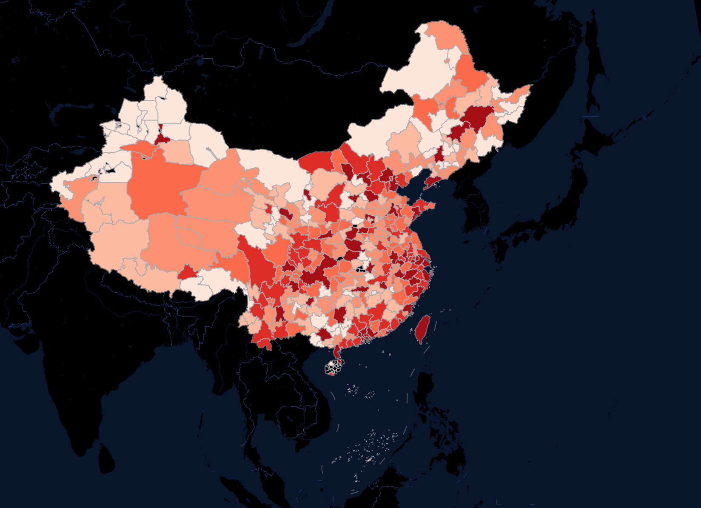
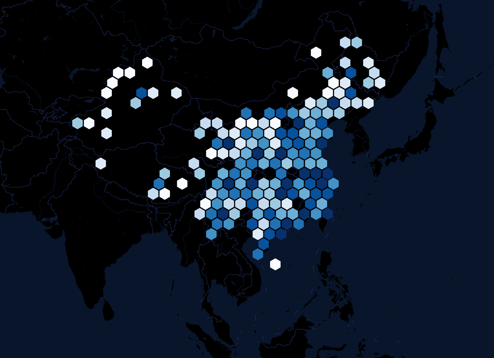
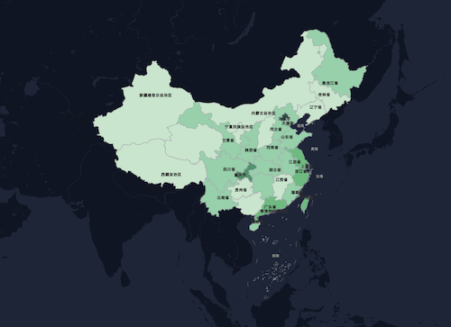
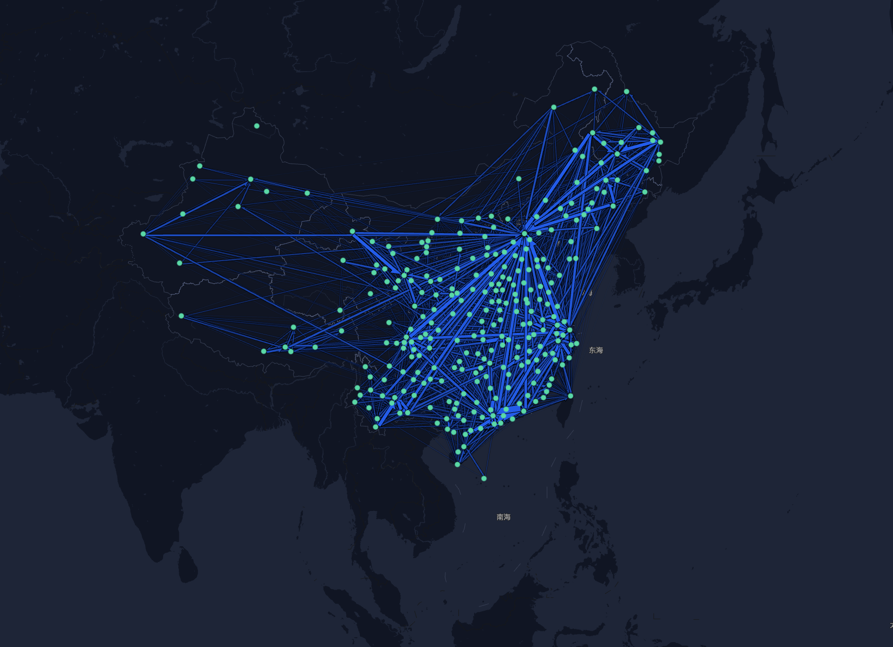

# CII
The code and data will be ready shortly; let's first look at the visualization. 

|  visualization                 | visualization             |
| :---:                          | :---:                     |
|           |      |
| CII Scatter Plot               | CII Heatmap               |
|           |      |
| CII Distribution               | Hexagonal Heatmap         |
|           |      |
| Provincial-level  Distribution | Interaction-flow (Graph)  |