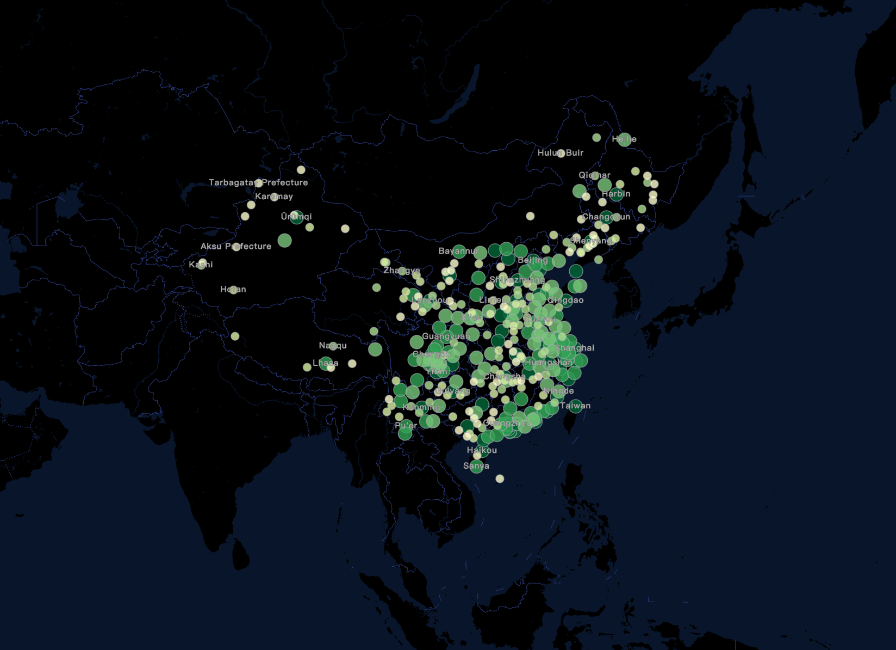
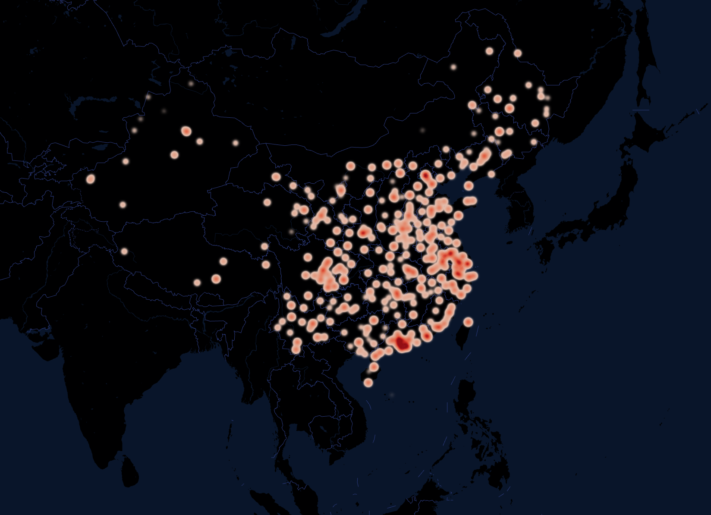
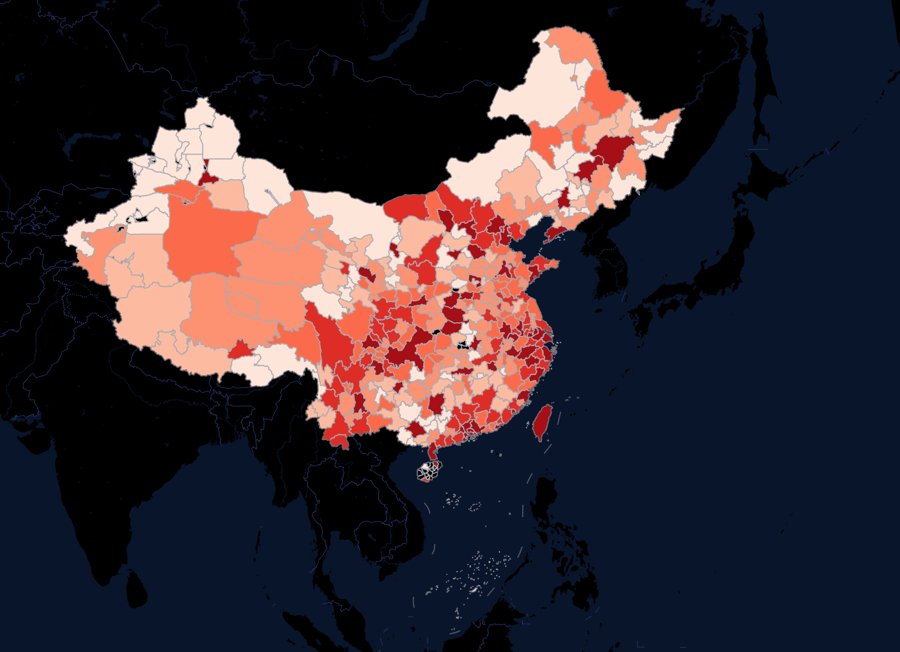
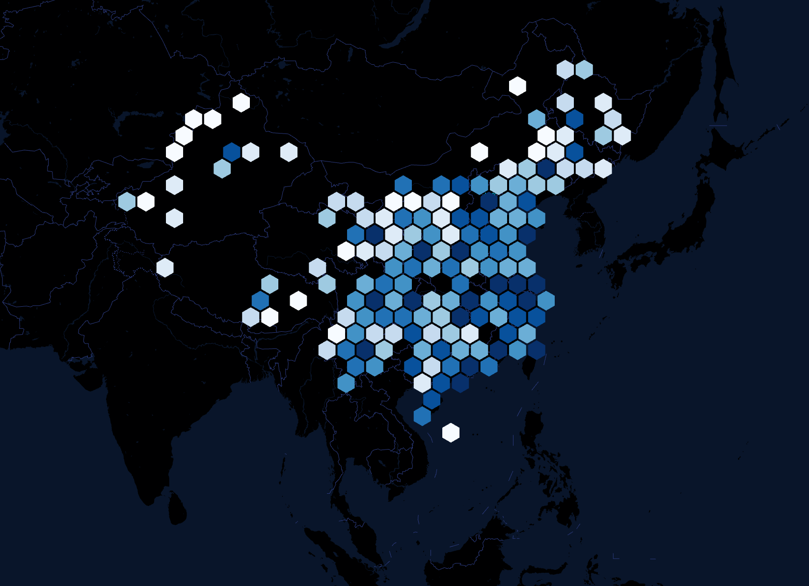
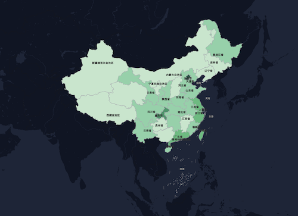
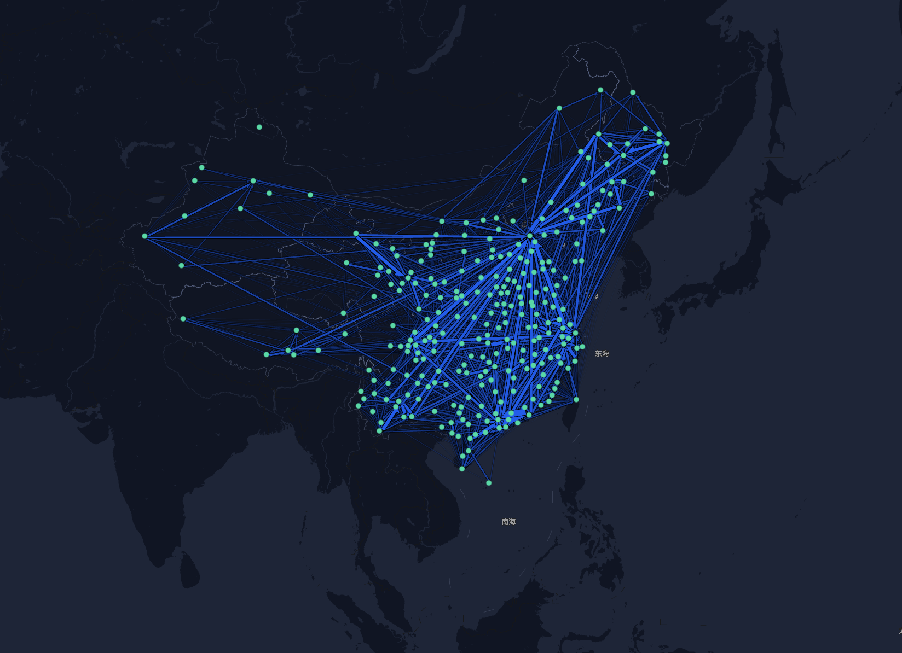

## City Influence Network: Mining and Analyzing the Influence of Chinese Cities Based on Social Media          

城市影响力网络：基于社会媒体挖掘和分析中国城市影响力                   

There have been very few studies done on measuring the influence of all prefecture-level cities on a national scale due to the limited availability of public data, challenges in data collection, and insufficient data comprehensiveness. In this paper, we aim to fill this gap by investigating this problem in China. We first collected 692,859 news articles spanning one full year from the WeChat Official Accounts of 339 cities and Taiwan Province, which served as our study area and dataset. Then, we developed a city extractor module to reduce the ambiguity of place names and constructed a city interaction network. Then, we modeled the City Influence Index (CII) and the intensity of its influence. Finally, we proposed an analytical framework that examines the relationship between CII and Gross Domestic Product (GDP), compares it with the Global Cities Index, conducts influence analysis of cities at different levels, and more. The experimental results demonstrate that our analytical framework can effectively measure the influence of cities on a national scale and uncover the implicit relationships between cities. In doing so, our study offers a new perspective for measuring city influence.                                         

The work has been published online. The DOI is [https://doi.org/10.1111/tgis.13249](https://doi.org/10.1111/tgis.13249)                                           

How to cite:                                             
Wang, L. and Jiang, S. (2024), City Influence Network: Mining and Analyzing the Influence of Chinese Cities Based on Social Media. Transactions in GIS, 28: 2509-2525. https://doi.org/10.1111/tgis.13249                   

- code/online-visualization: Visual analysis of spatial data, each file contains data;
- code/work: Notebooks for the experiments.

[Click here to experience the visualized results online](https://vczero.github.io/CII/)   

|  visualization                                                                                      | visualization                                                                             |
| :---:                                                                                               | :---:                                                                                     |
|         |  |
| CII Scatter Plot                                                                                    | CII Heatmap                                                                               |
|             |  |
| CII Distribution                                                                                    | Hexagonal Heatmap                                                                         |
|          |     |
| Provincial-level  Distribution                                                                      | Interaction-flow (Graph)  |  

Note: We used L7VP for data visualization online.    
Hope you enjoy it. 😊    
                               
Thanks to the icon resource library: https://iconpark.oceanengine.com/home
